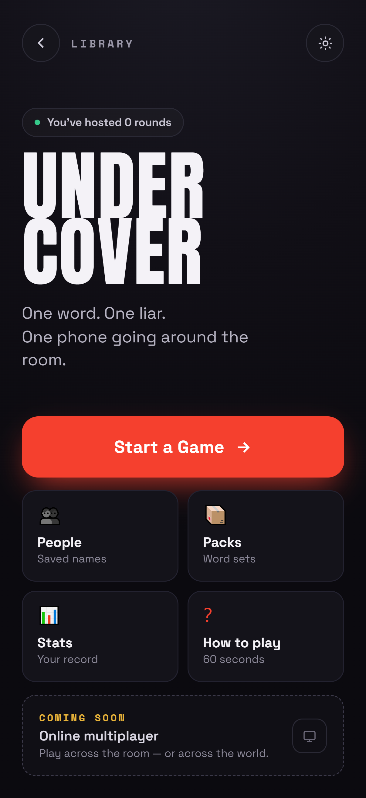
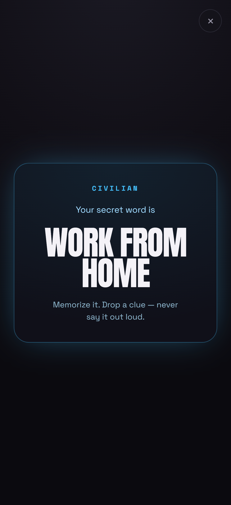
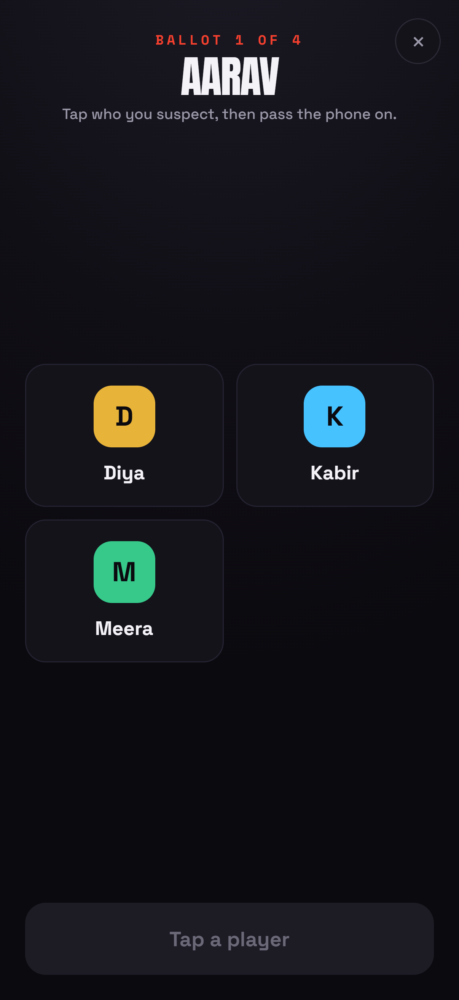
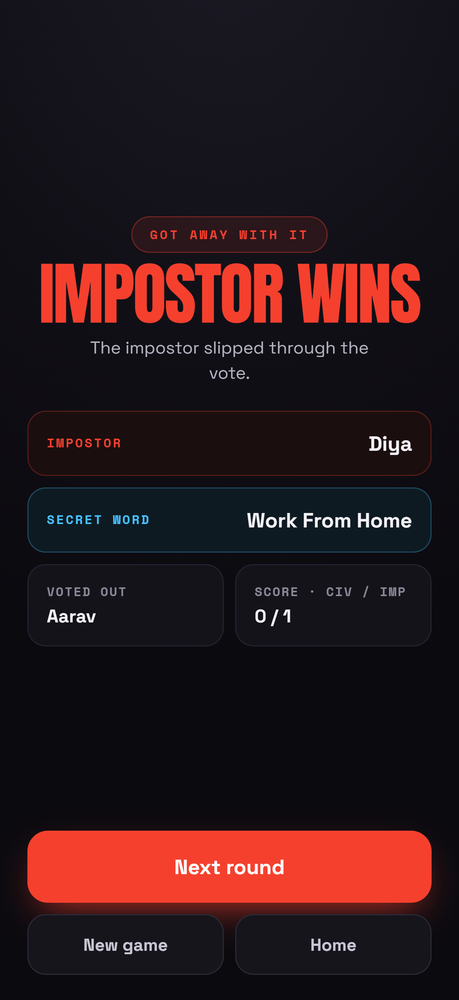

# Undercover — Party Impostor Game

[](https://github.com/abh1shekmishra/impostor-who/actions/workflows/ci.yml)
[](https://impostor-who-mu.vercel.app)
[](./LICENSE)


A pass-and-play social deduction game for a group sharing one phone. Everyone
gets the same secret word except the impostor. You take turns giving one-word
clues, argue about who's faking, then vote. If the impostor survives the vote,
they get one guess at the word to steal the win.

No login, no accounts, no backend. It installs as a PWA and works offline after
the first load.

**Play it live: [impostor-who-mu.vercel.app](https://impostor-who-mu.vercel.app)**

```
React 18 · TypeScript (strict) · Vite 5 · Tailwind 3 · Zustand · Framer Motion · PWA · Vitest
```

<p align="center">
  
  
  
  
</p>

---

## Quick start

```bash
npm install
npm run dev        # http://localhost:5173
npm run build      # typecheck + production bundle (dist/)
npm run preview    # serve the production build
npm run typecheck  # strict tsc, no emit
npm test           # run the unit test suite (Vitest)
npm run lint       # ESLint (flat config)
```

Installable as a PWA (Add to Home Screen). Works offline after first load.

---

## Testing

The game rules live in a **pure, side-effect-free engine** ([`src/lib/game.ts`](src/lib/game.ts))
and a **seedable PRNG** ([`src/lib/random.ts`](src/lib/random.ts)), which makes the
core logic fully unit-testable without a DOM. The suite ([Vitest](https://vitest.dev))
covers role dealing, deterministic seeding, vote tallies and ties, win/loss
resolution, the impostor's fuzzy final guess (Levenshtein-tolerant), and scoring.

```bash
npm test           # single run
npm run test:watch # watch mode
```

Every push runs **lint → type-check → test → build** in CI
([`.github/workflows/ci.yml`](.github/workflows/ci.yml)).

---

## Analytics (PostHog)

Analytics is wired through `src/lib/analytics.ts` and only initializes when a
PostHog key is present.

Create a `.env` (or `.env.local`) file in the project root:

```bash
VITE_POSTHOG_KEY=phc_xxxxxxxxxxxxxxxxxxxxxxxxxxxxxxxx
# Optional (defaults to PostHog Cloud)
VITE_POSTHOG_HOST=https://us.i.posthog.com
```

No key set = analytics disabled (safe for local/dev).

### Events emitted

- `screen_view` — on route change (`home`, `create`, `play`, etc.)
- `game_created` — when a match starts
- `round_started` — when a round is dealt
- `round_completed` — after vote resolution and after impostor guess resolution
- `impostor_guess` — when the impostor submits their final guess
- `settings_changed` — when a setting is updated/toggled

### Where events are fired

- `src/main.tsx` initializes analytics (`initAnalytics()`)
- `src/App.tsx` tracks screen views via `page(route)`
- `src/store/gameStore.ts` tracks gameplay lifecycle events
- `src/store/settingsStore.ts` tracks settings changes

---

## Features

- **Full game loop:** Home → Create Room → Lobby → Reveal → Clue → Discuss →
  Vote → Impostor's last guess → Result, with a running scoreboard across rounds.
- **11 game modes** (Classic, Double Agents, Blind, Chaos, Reverse, Hot Seat,
  Rapid Fire, One Word, No Talking, Emoji Clues, Act It Out). Each mode is a set
  of declarative rule flags, so the engine never branches on a mode id.
- **Content engine:** 130+ hand-authored words across 34 categories, each tagged
  with associations, semantic clusters, difficulty, and discussion/chaos/guess
  scores. A weighted selector balances freshness, recognizability and mode fit,
  and picks decoys for Reverse mode.
- **9 content packs** (curated and seasonal), including a "today's pack" chosen
  by date.
- **Feel:** card flips, spring transitions, canvas confetti, a drift-free timer
  ring, synthesized sound cues (no audio files), and haptics.
- **Settings:** light/dark/auto theme, sound, animations, haptics, hold-to-reveal,
  language, reset stats. **Stats:** games played, win rates, impostor record,
  favorite category.
- **Accessibility and resilience:** keyboard focus styles, ARIA roles/labels,
  44px touch targets, reduced-motion support, screen wake-lock during play, and
  an error boundary that recovers to home without losing settings or stats.

---

## Architecture

```
src/
├── types/            Domain models (content, game, settings) — the contract
├── data/
│   ├── words/        Seed corpus, one file per theme + a DRY authoring builder
│   ├── categories.ts Category metadata + groups for the Create Room UI
│   ├── modes.ts      Game modes as pure data (rule flags)
│   └── packs.ts      Curated / seasonal / AI content packs
├── lib/
│   ├── random.ts     Seedable PRNG, shuffle, weighted pick
│   ├── content.ts    Selection engine: filter → score → pick word + decoy
│   ├── game.ts       Role dealing, vote tally, outcome resolution, scoring
│   ├── feedback.ts   Unified sound + haptic cues
│   ├── sound.ts      Web-Audio synthesized cues (no assets)
│   └── haptics.ts    Vibration wrapper
├── store/            Zustand stores (game machine, settings, stats) — persisted
├── hooks/            useCountdown, useTheme, useConfetti, useReducedMotion, useWakeLock
├── components/
│   ├── ui/           Reusable primitives (Button, Card, Toggle, Chip, Sheet…)
│   ├── Screen.tsx    Consistent route/phase transition wrapper
│   └── ErrorBoundary.tsx
├── screens/          Home, CreateRoom, Settings, Stats, Packs, HowTo
│   └── play/         The in-match phase machine (one component per phase)
├── App.tsx           Route-keyed shell
└── main.tsx          Entry + ErrorBoundary
```

### State & the game machine

A single Zustand store (`gameStore`) is the in-match state machine. `phase`
advances through `reveal → clue → discuss → vote → impostor-guess → result`; the
engine in `lib/game.ts` is a set of pure functions (`dealRound`, `tallyVotes`,
`resolveVote`, `resolveImpostorGuess`, `applyScores`) so logic is testable and
deterministic given a seed. The whole game, settings, and stats persist to
`localStorage`, so a refresh mid-round resumes exactly where you left off.

### The content system

Words are not authored with a literal hint, because that produces lazy
giveaways. Instead each entry carries associative metadata describing the world
around the word, which is what pushes players to talk about adjacent concepts:

```ts
{
  text: 'Maggi',
  tags: ['hostel', '2 minutes', 'rain', 'childhood', 'late night',
         'exam', 'single vessel', 'yellow', 'comfort', 'lazy'],
  related: ['Pasta', 'Noodles', 'Ramen'],
  semanticClusters: ['comfort-food', 'instant'],
  difficulty: 'easy', popularity: 97, discussionScore: 90, ...
}
```

The schema (`types/content.ts`) is designed to scale to 50k+ entries and to be
populated by an **AI generation pipeline**: the same fields a model would produce
(tags, clusters, difficulty, discussion/chaos/guess scores, culture, safety) are
already first-class, and `source: 'seed' | 'ai' | 'community'` tracks provenance.
Seasonal/daily/IPL/festival packs (`data/packs.ts`) model that refresh workflow.

### Adding content

Drop a new file in `src/data/words/`, author entries with the `buildWords`
helper (fills sensible defaults so every emitted entry stays fully typed), and
append it to `src/data/words/index.ts`. Nothing else needs to change — the
selection engine, Create Room UI, packs and stats pick it up automatically.

---

## Design language

- **Tokens** are CSS variables (`--c-*`) resolved per theme and exposed to
  Tailwind as semantic colors (`bg-surface`, `text-ink-2`, `border`) so every
  component is theme-agnostic. Light/dark/auto are applied before first paint to
  avoid a flash.
- **Motion** is small, fast, and spring-based, and collapses to instant when the
  user (or OS) requests reduced motion.
- **Layout** is a centered phone-width column (`max-w-[480px]`) that scales
  comfortably to tablet and desktop. Safe-area insets are respected throughout.
- **Sound** is fully synthesized at runtime — pleasant, tiny, and disable-able —
  so the bundle ships no audio assets and works offline.

Recommended fonts to drop in for the intended look: **Clash Display** (display)
and **Inter** (body); the app falls back to system UI fonts cleanly if absent.

---

## Performance

- Manual chunks split `react`, `framer-motion`, and app code; the gzipped app
  bundle is ~38 kB.
- Service worker precaches the shell for instant, offline loads.
- Zustand selectors keep re-renders surgical; the timer is rAF + timestamp based
  (drift-free, survives tab backgrounding).

---

## License

Released under the [MIT License](./LICENSE). Word content is original or parody,
written for gameplay.
